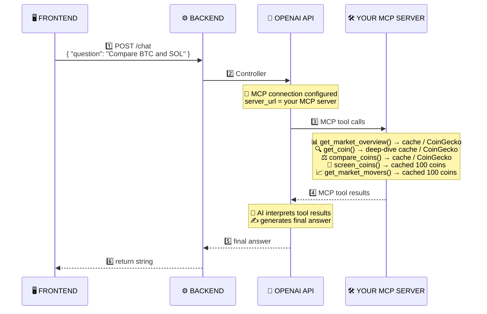
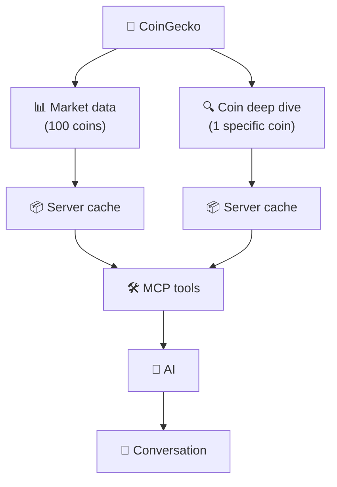

# 🪙 CryptoTracker — Backend

## 🧠 The Mental Model

That is essentially what I want to build here in this server:



### 📄 Plain-text version

```text
🖥️  FRONTEND
   │
   │  1️⃣  POST /chat
   │      { "question": "Compare BTC and SOL" }
   ▼
⚙️  BACKEND
   │
   │  2️⃣  Controller
   ▼
🤖 OPENAI API
   │
   │  🔌 MCP connection configured
   │     server_url = your MCP server
   ▼
🛠️  YOUR MCP SERVER
   │
   ├── 📊 get_market_overview()
   │        └── cache / CoinGecko
   │
   ├── 🔍 get_coin()
   │        └── deep-dive cache / CoinGecko
   │
   ├── ⚖️ compare_coins()
   │        └── cache / CoinGecko
   │
   ├── 🎯 screen_coins()
   │        └── cached 100 coins
   │
   └── 📈 get_market_movers()
            └── cached 100 coins
   │
   │  4️⃣  MCP tool results
   ▼
🤖 OPENAI API
   │
   │  🧠 AI interprets tool results
   │  ✍️ generates final answer
   ▼
⚙️  BACKEND
   │
   │  5️⃣  return string
   ▼
🖥️  FRONTEND
```

## 🔄 The Data Flow



### 📄 Plain-text version

```text
                🦎 CoinGecko
                    │
          ┌─────────┴─────────┐
          │                   │
    📊 Market data       🔍 Coin deep dive
      (100 coins)         (1 specific coin)
          │                   │
          ▼                   ▼
    📦 Server cache      📦 Server cache
          │                   │
          └────────┬──────────┘
                   ▼
               🛠️ MCP tools
                   │
                   ▼
                 🧠 AI
                   │
                   ▼
             💬 Conversation
```
